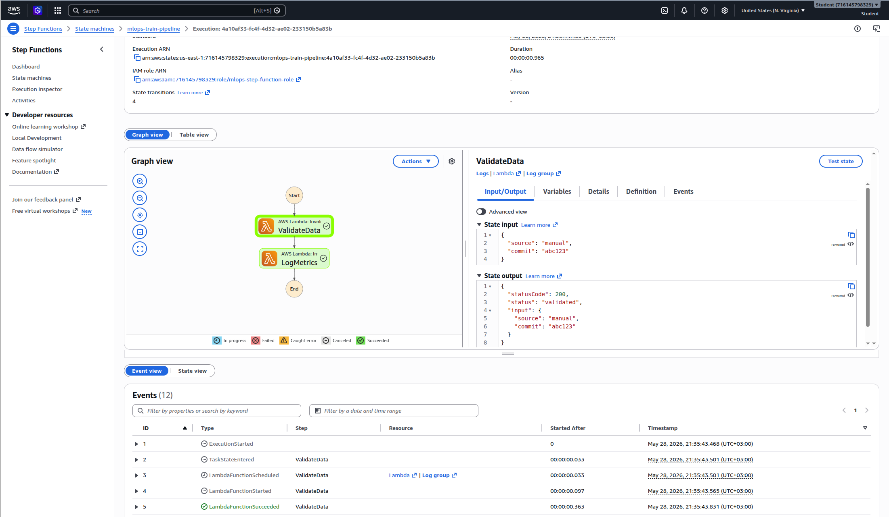
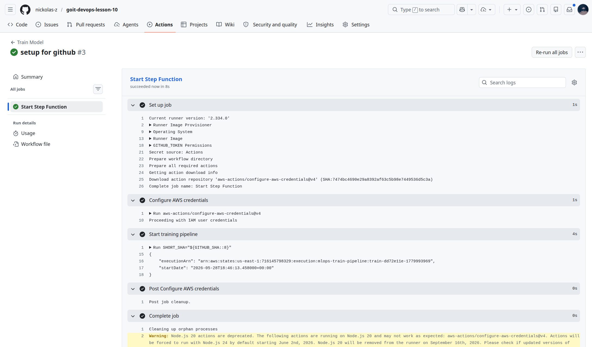

# Lesson 10 — MLOps Train Automation

Автоматизація тренування моделей через AWS Step Functions + Lambda, розгорнута через Terraform з інтеграцією GitHub Actions.

## Конфігурація за замовчуванням

AWS-налаштування взяті з попередніх GoIT DevOps проєктів: локальний Terraform використовує профіль `devops` з `~/.aws/config` / `~/.aws/credentials`, а регіон — `us-east-1`. Значення `AWS_ACCESS_KEY_ID` та `AWS_SECRET_ACCESS_KEY` не зберігаються в репозиторії; для GitHub Actions їх потрібно додати як repository secrets з того самого AWS профілю.

| Параметр | Значення |
| --- | --- |
| AWS Region | `us-east-1` |
| AWS Profile | `devops` |
| Validate Lambda | `mlops-validate` |
| Log Metrics Lambda | `mlops-log-metrics` |
| Step Function | `mlops-train-pipeline` |
| Lambda Runtime | `python3.12` |

## Архітектура

```text
GitHub Actions (push) -> aws stepfunctions start-execution
                                  ↓
                      Step Function: mlops-train-pipeline
                                  ↓
                      Step 1: ValidateData  (Lambda: mlops-validate)
                                  ↓
                      Step 2: LogMetrics    (Lambda: mlops-log-metrics)
```

## Структура проєкту

```text
mlops-train-automation/
├── terraform/
│   ├── main.tf          # IAM ролі, Lambda, Step Function
│   ├── variables.tf
│   └── lambda/
│       ├── validate.py
│       ├── log_metrics.py
│       ├── validate.zip
│       └── log_metrics.zip
├── .github/
│   └── workflows/
│       └── train-model.yml
└── README.md
```

## Передумови

| Інструмент | Версія |
| --- | --- |
| Terraform | >= 1.3 |
| AWS CLI | >= 2 |
| Python | >= 3.12 |
| zip | будь-яка |

## Зібрати Lambda-архіви

```bash
cd terraform/lambda
zip validate.zip validate.py
zip log_metrics.zip log_metrics.py
```

## Розгорнути інфраструктуру через Terraform

```bash
cd terraform
terraform init
terraform apply
```

Terraform створить:

- IAM роль для Lambda (`mlops-lambda-execution-role`)
- IAM роль для Step Functions (`mlops-step-function-role`) з дозволом на виклик Lambda
- Lambda-функції `mlops-validate` та `mlops-log-metrics`
- Step Function `mlops-train-pipeline` з двома кроками: `ValidateData → LogMetrics`

Після завершення `terraform apply` виведе ARN стейт-машини:

```text
Real outputs:
state_machine_arn = "arn:aws:states:us-east-1:716145798329:stateMachine:mlops-train-pipeline"
```

## Вручну перевірити Step Function через AWS Console

1. Відкрити [AWS Console → Step Functions](https://console.aws.amazon.com/states/)
2. Знайти `mlops-train-pipeline`
3. Натиснути **Start execution**
4. Передати JSON:

```json
{
  "source": "manual",
  "commit": "abc123"
}
```

5. Перевірити, що обидва стани (`ValidateData` та `LogMetrics`) виконались зі статусом **Succeeded**
6. Логи Lambda доступні в **CloudWatch Logs** → `/aws/lambda/mlops-validate` та `/aws/lambda/mlops-log-metrics`


## GitHub Actions

### Як працює workflow

Файл `.github/workflows/train-model.yml` містить workflow `Train Model`. При кожному `push` до GitHub репозиторію:

1. Запускає job `train-model` на `ubuntu-latest`
2. Налаштовує AWS credentials через `aws-actions/configure-aws-credentials@v4`
3. Виконує `aws stepfunctions start-execution` з унікальним іменем `train-<short-sha>-<timestamp>`
4. Передає JSON з джерелом та SHA коміту

### Необхідні GitHub Secrets

| Змінна | Значення |
| --- | --- |
| `AWS_ACCESS_KEY_ID` | Access key з локального AWS профілю `devops` |
| `AWS_SECRET_ACCESS_KEY` | Secret key з локального AWS профілю `devops` |
| `STATE_MACHINE_ARN` | ARN з виводу `terraform apply` |

Додати через: **Settings -> Secrets and variables -> Actions -> New repository secret**

`AWS_DEFAULT_REGION` задано напряму у workflow як `us-east-1`.

### Приклад JSON, що передається через GitHub Actions

```json
{
  "source": "github-actions",
  "commit": "a1b2c3d4"
}
```

де `commit` — перші 8 символів значення `$GITHUB_SHA`.


### Альтернативний приклад: GitLab CI job

Проєкт зараз запускає пайплайн через GitHub Actions, але той самий сценарій у GitLab CI працював би аналогічно: job бере AWS credentials зі змінних GitLab, запускає офіційний AWS CLI image і викликає `aws stepfunctions start-execution`.

```yaml
stages:
  - train

train-model:
  stage: train
  image: amazon/aws-cli:2.15.0
  variables:
    AWS_DEFAULT_REGION: "us-east-1"
  script:
    - |
      aws stepfunctions start-execution \
        --state-machine-arn "$STATE_MACHINE_ARN" \
        --name "gitlab-train-${CI_COMMIT_SHORT_SHA}-${CI_PIPELINE_IID}" \
        --input "{\"source\":\"gitlab-ci\",\"commit\":\"${CI_COMMIT_SHORT_SHA}\"}"
  only:
    - pushes
```

Для такого job у **Settings -> CI/CD -> Variables** потрібно додати `AWS_ACCESS_KEY_ID`, `AWS_SECRET_ACCESS_KEY` та `STATE_MACHINE_ARN`.

### Результати виконання (команди для перевірки)

```bash
❯ aws stepfunctions list-executions \
  --state-machine-arn "$(terraform -chdir=terraform output -raw state_machine_arn)" \
  --region us-east-1 \
  --profile devops
{
    "executions": [
        {
            "executionArn": "arn:aws:states:us-east-1:716145798329:execution:mlops-train-pipeline:train-dd72e11e-1779993969",
            "stateMachineArn": "arn:aws:states:us-east-1:716145798329:stateMachine:mlops-train-pipeline",
            "name": "train-dd72e11e-1779993969",
            "status": "SUCCEEDED",
            "startDate": 1779993973.458,
            "stopDate": 1779993974.453,
            "redriveCount": 0
        },
        {
            "executionArn": "arn:aws:states:us-east-1:716145798329:execution:mlops-train-pipeline:4a10af33-fc4f-4d32-ae02-233150b5a83b",
            "stateMachineArn": "arn:aws:states:us-east-1:716145798329:stateMachine:mlops-train-pipeline",
            "name": "4a10af33-fc4f-4d32-ae02-233150b5a83b",
            "status": "SUCCEEDED",
            "startDate": 1779993343.468,
            "stopDate": 1779993344.433,
            "redriveCount": 0
        }
    ]
}
```

```bash
❯ START_TIME=$(( ($(date +%s) - 3600) * 1000 ))

aws logs filter-log-events \
  --log-group-name /aws/lambda/mlops-validate \
  --start-time "$START_TIME" \
  --region us-east-1 \
  --profile devops \
  --query 'events[].message' \
  --output text
INIT_START Runtime Version: python:3.12.mainlinev2.v7   Runtime Version ARN: arn:aws:lambda:us-east-1::runtime:e4ab553846c4e081013ff7d1d608a5358d5b956bb5b81c83c66d2a31da8f6244
        START RequestId: 0954acab-ed3f-494f-97c8-9791e0728419 Version: $LATEST
        Validating data...
        Input: {"source": "manual", "commit": "abc123"}
        END RequestId: 0954acab-ed3f-494f-97c8-9791e0728419
        REPORT RequestId: 0954acab-ed3f-494f-97c8-9791e0728419  Duration: 2.03 ms       Billed Duration: 90 ms  Memory Size: 128 MB     Max Memory Used: 36 MB  Init Duration: 87.78 ms
        INIT_START Runtime Version: python:3.12.mainlinev2.v7   Runtime Version ARN: arn:aws:lambda:us-east-1::runtime:e4ab553846c4e081013ff7d1d608a5358d5b956bb5b81c83c66d2a31da8f6244
        START RequestId: ed93d4b2-e802-45b6-b099-e3e4ec31bc95 Version: $LATEST
        Validating data...
        Input: {"source": "github-actions", "commit": "dd72e11e"}
        END RequestId: ed93d4b2-e802-45b6-b099-e3e4ec31bc95
        REPORT RequestId: ed93d4b2-e802-45b6-b099-e3e4ec31bc95  Duration: 2.71 ms       Billed Duration: 107 ms Memory Size: 128 MB     Max Memory Used: 36 MB  Init Duration: 103.92 ms
```

```bash
❯ aws logs filter-log-events \
  --log-group-name /aws/lambda/mlops-log-metrics \
  --start-time "$START_TIME" \
  --region us-east-1 \
  --profile devops \
  --query 'events[].message' \
  --output text
INIT_START Runtime Version: python:3.12.mainlinev2.v7   Runtime Version ARN: arn:aws:lambda:us-east-1::runtime:e4ab553846c4e081013ff7d1d608a5358d5b956bb5b81c83c66d2a31da8f6244
        START RequestId: efbc0f6a-3097-42b8-8610-43546da4eac2 Version: $LATEST
        Logging metrics...
        Input: {"statusCode": 200, "status": "validated", "input": {"source": "manual", "commit": "abc123"}}
        END RequestId: efbc0f6a-3097-42b8-8610-43546da4eac2
        REPORT RequestId: efbc0f6a-3097-42b8-8610-43546da4eac2  Duration: 2.15 ms       Billed Duration: 108 ms Memory Size: 128 MB     Max Memory Used: 36 MB  Init Duration: 104.98 ms
        INIT_START Runtime Version: python:3.12.mainlinev2.v7   Runtime Version ARN: arn:aws:lambda:us-east-1::runtime:e4ab553846c4e081013ff7d1d608a5358d5b956bb5b81c83c66d2a31da8f6244
        START RequestId: b3691315-be86-4d80-8fc6-bbf91846a231 Version: $LATEST
        Logging metrics...
        Input: {"statusCode": 200, "status": "validated", "input": {"source": "github-actions", "commit": "dd72e11e"}}
        END RequestId: b3691315-be86-4d80-8fc6-bbf91846a231
        REPORT RequestId: b3691315-be86-4d80-8fc6-bbf91846a231  Duration: 2.12 ms       Billed Duration: 115 ms Memory Size: 128 MB     Max Memory Used: 36 MB  Init Duration: 112.29 ms
```

## Знищення інфраструктури

```bash
cd terraform
terraform destroy
```

Приклад реального результату:

```text
Destroy complete! Resources: 7 destroyed.
```

> **Увага:** `terraform destroy` видалить Step Function, Lambda-функції, IAM ролі та IAM policy, створені цим Terraform проєктом.
> Не забудьте **видалити GitHub Secrets вручну після знищення інфраструктури**, щоб AWS credentials не залишались в GitHub.